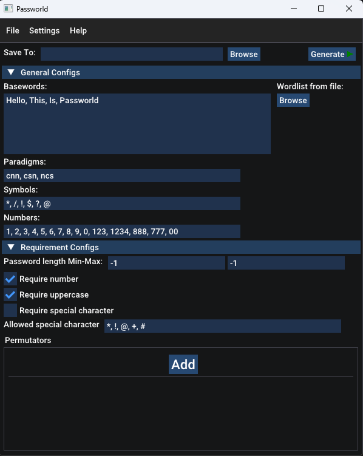

# Passworld
Passworld is a fully customizable password wordlist generator which aims to help Red Teamers in unveiling weak passwords composed by user's known information and constructed on typical human password paradigms.\
It is written in C++ to achieve best performances and be cross-platform.\
The GUI is built on Dear ImGui.


# Getting started
Dependencies are: Dear Imgui, glfw
## Windows with Visual Studio
### Prerequisites
**vcpkg** (or add glfw lib manually to Visual Studio project, download precompiled binaries here: https://www.glfw.org/download)

**git**
### Installation
- Run:
```
vcpkg integrate install
vcpkg install glfw3
git clone --recursive git@github.com:SilvestriF3/Passworld.git
```
- Open Visual Studio Passworld.sln
- Build project
---
## Linux Ubuntu/Debian
### Install dependencies
```
sudo apt-get install -y build-essential cmake git libglfw3-dev
```
Clone & compile Passworld:
```
git clone --recursive git@github.com:SilvestriF3/Passworld.git                    
chmod +x configure.sh build.sh
./configure.sh
./build.sh
```

# Documentation & usage
For more instructions & tips refer to [this page](Docs/DOCUMENTATION.md).

# Contributing & future development
Any contribution is welcomed, you can help by:
- Improving GUI & UX
- Add new permutators and rules for more customizability
- Reporting bugs
- Optimizing code
## Features to add:
- [ ] Split output files in smaller pieces
- [ ] Ranking and sorting accordingly candidates based on computed likelihood 
- [ ] Integration with John & Hashcat (?)
- [ ] Config import/export
- [ ] Analyses on real world passwords to find most common traits, paradigms and sequence of characters used to improve preset data
